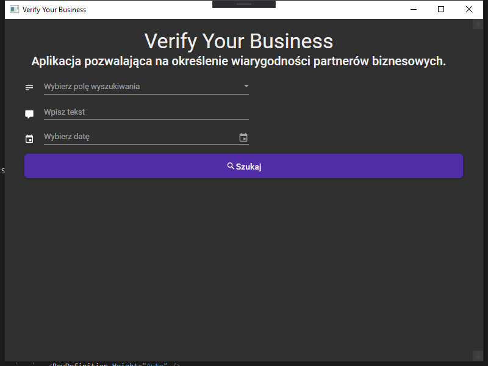
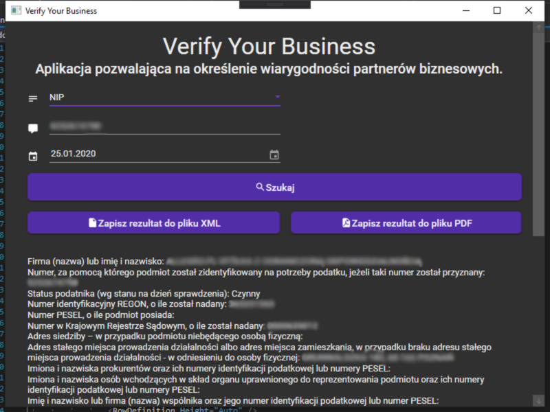
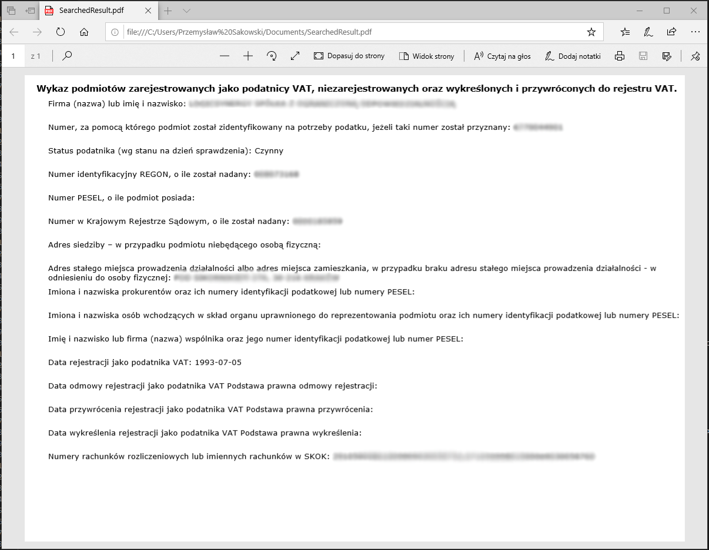
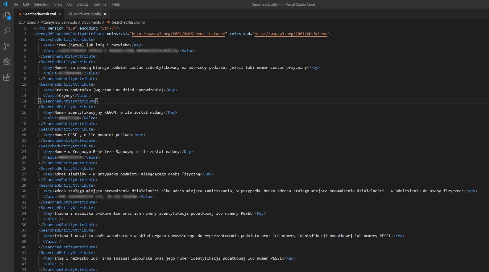

# Verify-Your-Business

Aplikacja "Verify Your Business" pozwala na określenie wiarygodności partnerów biznesowych poprzez sprawdzanie statusu podatnika VAT oraz ogólnodostępnych danych płatników VAT, a także umożliwia weryfikację numeru konta bankowego.

### Funkcje

- metoda „search”– aby z niej skorzystać, wybierz jeden z parametrów: NIP, REGON oraz dzień, na jaki mają być wyświetlone informacje o podmiocie
- cały zakres danych z wykazu o podmiotach, o które pytasz
- metodę uproszczoną „check”, która poprzez API skrócone będzie łączyła cię z wykazem po wprowadzeniu parametrów zapytania NIP LUB REGON
- Gernerowanie PDF oraz XML z informacjami o podmiocie

## Spis treści
* [Informacje ogólne](#Verify-Your-Business)
* [Funkcje](#funkcje)
* [Instalacja](#setup)

## General info
This project is simple Lorem ipsum dolor generator.
	
## Technologies
Project is created with:
* Lorem version: 12.3
* Ipsum version: 2.33
* Ament library version: 999
	
## Setup
To run this project, install it locally using npm:

```
$ cd ../lorem
$ npm install
$ npm start
```

Verify-Your-Business-Installer.exe






## Twórcy

- Przemysław Sakowski

- Maksymilian Stępak

- Szymon Ryczek

## Licencja

Projekt jest objęty licencją MIT - szczegóły w pliku LICENCE
